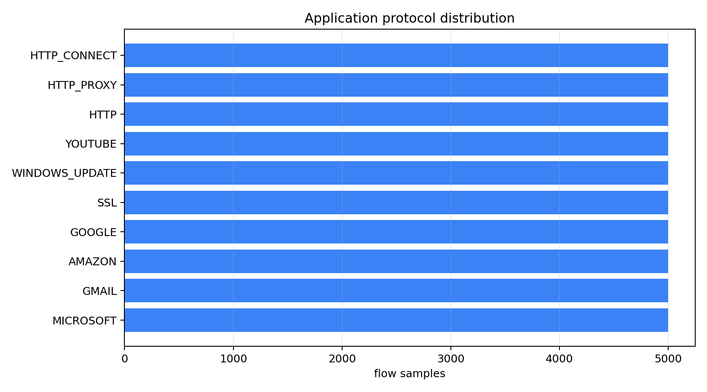
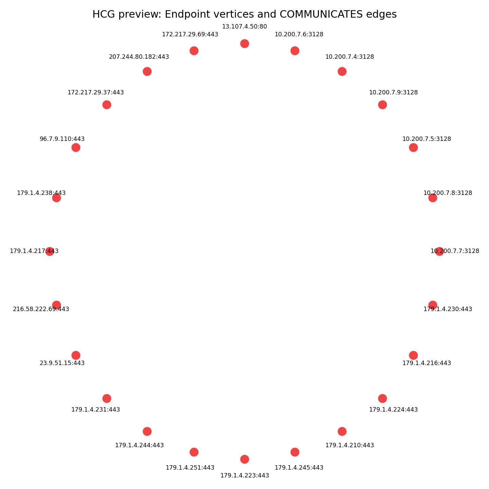
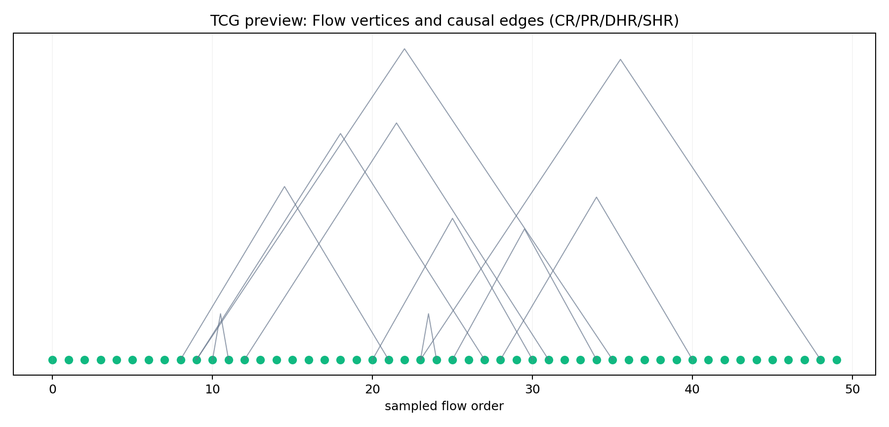
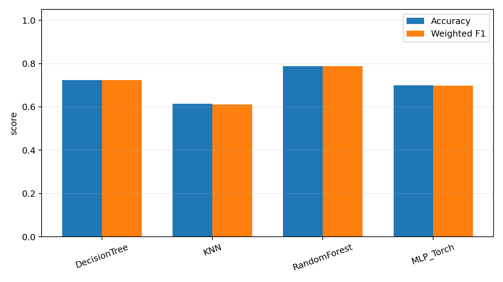
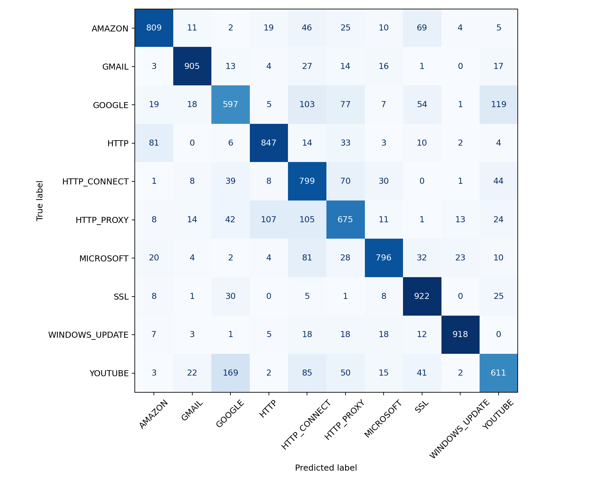
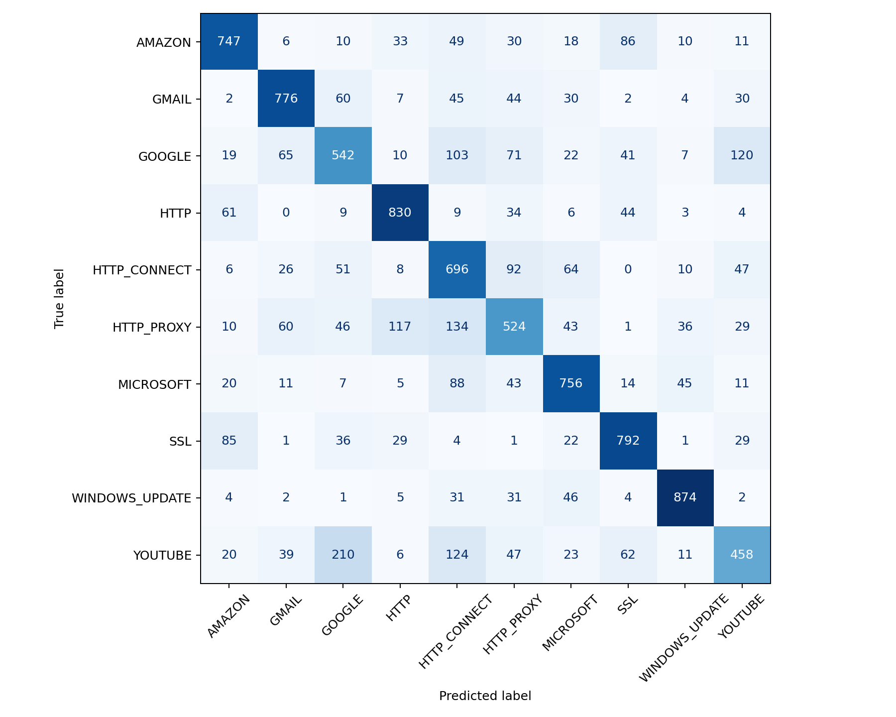

# 安全通论实验 3：网络流量分类

## 1. 数据集

- 数据集：IP Network Traffic Flows Labeled with 75 Apps / 87 attributes
- 本地文件：`Dataset-Unicauca-Version2-87Atts.csv/Dataset-Unicauca-Version2-87Atts.csv`
- 原始字段：87 列，包含五元组、流持续时间、包长统计、IAT、TCP flag、吞吐量、应用层协议等。
- 本次实验抽样：先扫描 600,000 行，选择出现次数最多的 10 个应用类别，每类最多 5,000 条，共 50,000 条流。

类别分布：

| ProtocolName   |   count |
|:---------------|--------:|
| MICROSOFT      |    5000 |
| GMAIL          |    5000 |
| AMAZON         |    5000 |
| GOOGLE         |    5000 |
| SSL            |    5000 |
| WINDOWS_UPDATE |    5000 |
| YOUTUBE        |    5000 |
| HTTP           |    5000 |
| HTTP_PROXY     |    5000 |
| HTTP_CONNECT   |    5000 |



## 2. 论文依据与图建模

参考《互联网流量分类中流量特征研究_刘珍》对流量特征和连接图的讨论，以及《基于时空图神经网络的网络异常检测与流量分类_苏永才》第 4 章的 Node2Vec 嵌入方法，本实验实现两种图建模：

### 2.1 HCG（Host Communication Graph）

将 `{IP, port}` 二元组建模为 `Endpoint` 顶点；如果两个端点之间存在一条流，则建立 `COMMUNICATES` 边，边属性保存协议、流持续时间、包数和字节数。

- HCG Endpoint 顶点：43,783
- HCG COMMUNICATES 边：50,000



### 2.2 TCG（Traffic Causality Graph）

将原始流建模为 `Flow` 顶点；按照刘珍论文定义四种流间因果关系边（时间窗口 60s）：

| 边类型 | 含义 | 数量 |
|:---|---:|---:|
| **CR** (Communication Relationship) | 双向通信关系：protocol(f1)=protocol(f2) ∧ src↔dst, dst↔src | 445 |
| **PR** (Propagation Relationship) | 传播关系：dstIp(f1) = srcIp(f2) | 23,920 |
| **DHR** (Dynamic-Port Host Relationship) | 动态端口关系：srcIp 相同 ∧ srcPort 不同 | 35,472 |
| **SHR** (Static-Port Host Relationship) | 静态端口关系：srcIp 相同 ∧ srcPort 相同 | 6,122 |

- TCG Flow 顶点：50,000
- TCG 因果边总计：65,959



### 2.3 图嵌入与特征融合

参考苏永才论文（Node2Vec，p=0.3, q=0.7, walk_length=7）进行图嵌入：

- **HCG 节点嵌入**：Node2Vec 对端点通信图做无向图嵌入（dim=16），生成端点向量
- **HCG 边嵌入**：拼接源/目的端点嵌入 + 绝对差 + 哈达玛积（Hadamard product），共 64 维
- **TCG 流嵌入**：对 CR/PR/DHR/SHR 四种边类型分别独立做 Node2Vec 有向图嵌入（dim=8 each），拼接为 32 维
- **结构特征**：源/目的端点总度、出度、入度、加权字节度，共 6 维
- **原始流统计特征**：数值型流量统计特征（排除 ID/IP/时间戳等非数值字段）

最终融合特征维度 = 原始数值特征 + 64（HCG边嵌入）+ 32（TCG流嵌入）+ 6（结构特征）

## 3. TuGraph 导入

TuGraph 导入文件已生成在 `tugraph_import/`：

| 文件 | 说明 |
|---|---|
| `hcg_vertices_endpoint.csv` | HCG Endpoint 顶点 |
| `hcg_edges_communicates.csv` | HCG COMMUNICATES 边 |
| `tcg_vertices_flow.csv` | TCG Flow 顶点 |
| `tcg_edges_CR.csv` | CR 双向通信边 |
| `tcg_edges_PR.csv` | PR 传播边 |
| `tcg_edges_DHR.csv` | DHR 动态端口边 |
| `tcg_edges_SHR.csv` | SHR 静态端口边 |
| `import.json` | TuGraph 离线导入配置 |
| `tugraph_schema_reference.json` | Schema 参考文档 |
| `sanity_checks.cypher` | Cypher 查询示例 |

## 4. 分类器与评价指标

训练/测试集按 stratified split 划分，测试比例为 0.2（8,000 条）。评价指标包括 Accuracy、weighted Precision、weighted Recall、weighted F1。

**实验配置**：scan_rows=600,000, top_classes=10, samples_per_class=5,000, embedding_dim=16, epochs=50, batch_size=512, causal_window=60s。

| 分类器 | Accuracy | Precision | Recall | F1 |
|---|---:|---:|---:|---:|
| DecisionTree | 0.7235 | 0.7266 | 0.7235 | 0.7239 |
| KNN | 0.6142 | 0.6103 | 0.6142 | 0.6111 |
| RandomForest | 0.7879 | 0.7916 | 0.7879 | 0.7875 |
| MLP_Torch | 0.6995 | 0.6998 | 0.6995 | 0.6973 |



**最佳模型：RandomForest（weighted F1 = 0.7875）**

与旧版实验对比（8 类，每类 4,000，dim=8，12 epochs）：

| 分类器 | 旧版 F1 | 新版 F1 | 提升 |
|---|---:|---:|---:|
| DecisionTree | 0.6967 | 0.7239 | +2.72% |
| KNN | 0.6134 | 0.6111 | -0.23% |
| RandomForest | 0.7594 | 0.7875 | +2.81% |
| MLP_Torch | 0.5638 | 0.6973 | +13.35% |

MLP 提升最显著，得益于 embedding_dim 从 8 增加到 16、epochs 从 12 增加到 50，以及 TCG 四种边类型的精细建模。

### 混淆矩阵

**RandomForest（最佳模型）**：


**DecisionTree**：


**MLP_Torch**：


**KNN**：


## 5. TensorBoard 监控

PyTorch MLP 的训练过程已写入 `runs/network_traffic_mlp/`：

```powershell
tensorboard --logdir runs
```

或使用本机 Python：

```powershell
& D:\Python313\python.exe -m tensorboard.main --logdir runs
```

监控指标包括 `loss/train`、`metrics/test_accuracy`、`metrics/test_f1_weighted` 和 `metrics/learning_rate`。

## 6. 复现实验命令

```powershell
& D:\Python313\python.exe scripts\run_experiment.py --scan-rows 600000 --top-classes 10 --samples-per-class 5000 --embedding-dim 16 --epochs 50 --batch-size 512 --causal-window-seconds 60
```

## 7. 结果文件

- 分类报告：`outputs/*_classification_report.csv`
- 混淆矩阵：`outputs/*_confusion_matrix.png`
- 模型文件：`outputs/*.joblib`、`outputs/mlp_model.pt`
- 预处理管线：`outputs/preprocess.joblib`
- 融合特征：`outputs/fused_features_sample.csv`
- 指标汇总：`outputs/metrics_summary.csv` / `metrics_summary.json`
- 可视化：`outputs/dataset_protocol_distribution.png`、`outputs/hcg_graph_preview.png`、`outputs/tcg_causal_preview.png`、`outputs/classifier_metric_summary.png`
